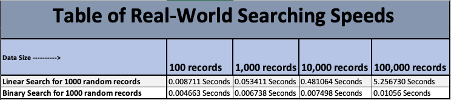

# CEIS295 Class Projects

## Week 1 & Week 2
### This is a comparison of speed in relation to different algorithms.

 

---
## Week 3 
### demonstrates the use of a Queue ADT.

 

---
## Week 4
### demonstrates the speeds of different sorting algorithms.

 

---
## Week 5
### demonstrates the speeds of different searching algorithms.

---
## Week 6
### demonstrates the speeds of binary trees.
